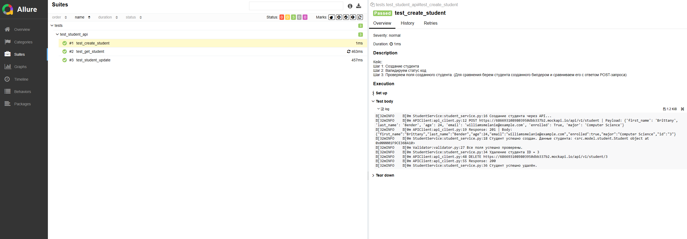

# API Test Framework

Фреймворк разработан для автоматизированного тестирования REST API с акцентом на чистую архитектуру, расширяемость и читаемость.

## Основные компоненты

### `src/api/`
- **`api_client`** — обёртка над HTTP-запросами (POST, GET, PUT, DELETE), абстрагирована от конкретных данных. Поддерживает повторное использование и масштабирование.
- **`endpoints`** — централизованное хранилище endpoint-ов (URL).
- **`student_service`** — сервисный слой, реализующий бизнес-логику взаимодействия с моделью `Student`. Вызывает методы `api_client`.

### `src/builders/`
- **`student_builder`** — генератор валидных данных для создания объекта `Student`.
- **`student_update_builder`** — генератор новых (отличающихся) данных для обновления сущности через PUT-запрос.

### `src/model/`
- **`Student`** — модель, описывающая структуру сущности `Student`.

### `src/validators/`
- **`validator`** — класс-обёртка для assert-проверок.  
  Используется в тестах для проверки status-кодов и сравнения `expected_data` vs `actual_data`.

---

## Прочее

- **`tests/`** — тесты на создание, обновление и валидацию сущности Student.
- **`pytest.ini`** — конфигурация PyTest.
- **`Jenkinsfile`** — пайплайн CI для запуска автотестов.
- **`requirements.txt`** — зависимости проекта.

---

## Цель проекта

Целью проекта было не просто покрытие API-тестами, а построение архитектурно продуманного, расширяемого фреймворка. В основе — паттерны проектирования, разделение ответственности и принципы SOLID. Архитектура универсальна и может использоваться в любых API-проектах.

---

## Пример Allure-отчёта

__

---

## Технологии

- Python
- PyTest
- Allure
- Jenkins

---